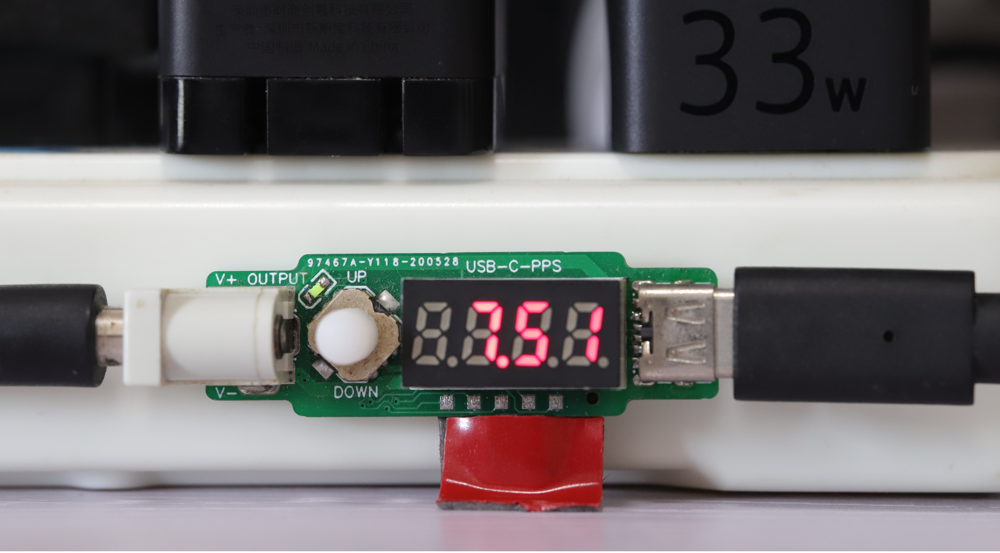

# USB Programmable Power Supply




## Build

Set an environment variable that points to [GNU Arm Embedded Toolchain](https://developer.arm.com/tools-and-software/open-source-software/developer-tools/gnu-toolchain/gnu-rm/downloads), for example:

```
export GCC_PATH=/opt/gcc-arm-none-eabi-8-2019-q3-update/bin/
```

Then build the firmware with make:

```
make
```

If the compilation completed successfully, download `build/UCDC.bin` to the STM32 with ST-Link or J-Link.
